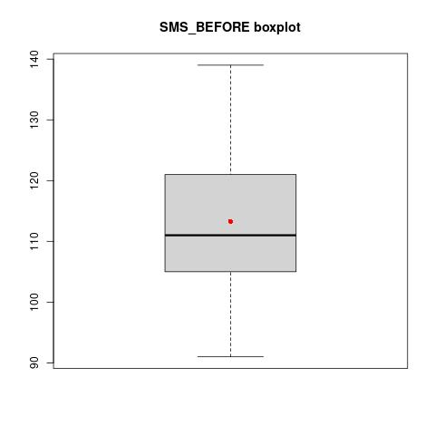

<h2> Δομή της άσκησης</h2>


<p> Για τα τρία ερωτήματα της άσκησης , έχουν φτιαχτεί 3 διαφορετικά R scripts. <strong>Christmas_exercise_Α.R</strong> 
για το πρώτο ερώτημα, &nbsp<strong>Christmas_exercise_Β.R</strong> για το δεύτερο και <strong>Christmas_exercise_C.R</strong>&nbsp για το τρίτο. </p>


<h2>Εκτέλεση</h2>

<p> ΠΡΟΣΟΧΗ! : Στην αρχή κάθε script εκτελείται η εντολή  "rm(list = ls())"
που καθαρίζει όλες τις αποθηκευμένες μεταβλητές της μνήμης. Αν έχουμε κάτι χρήσιμο στη 
μνήμη θα πρέπει να το σώσουμε ή να κανουμε comment out τη γραμμή.</p>


<p> Για να εκτελέσουμε κάποια από τις τρεις ασκήσεις θα πρέπει στο R project να έχουμε ανεβάσει το 
  script που αντιστοιχεί στην άσκηση και να είναι διαθέσιμο το αρχείο δεδομένων R_LAB_DATA_NEW_V3.xlsx.
Στη συνέχεια με την εντολή "source()" εκτελούμε όλο το script.</p>

```
> source("Christmas_exercise_Α.R")
########################################################## Ερώτημα Α #####################################            

               Υπολογισμός μέτρων θέσης 	

                    Ερώτημα Α.1 	

Η μέση τιμή είναι των μηνυμάτων x_bar = 113.28 
Η διάμεσος για το δείγμα είναι m = 111 
Ο διάμεσος μπορεί να προκύψει εναλλακτικά από το 0.5 ποσοστημόριο............................... 
```

<h2>Διαγράμματα</h2>


<p> Τα διαγράμματα αποθηκεύονται στον φάκελο του project. Για τα boxplots η κόκκινη κουκίδα είναι η μέση τιμή.</p>

<p>   </p>
  
<h2>Περιβάλλον ανάπτυξης</h2>

<p> To project το δημιούργησα τοπικά στην έκδοση  R version 4.0.3 (2020-10-10) </p>
<p> Ωστόσο το δοκίμασα στο περιβάλλον εργαστηρίου που τρέχει στην ip http://10.100.59.165:8787 την έκδοση R version 3.4.4 (2018-03-15)  
και δεν διαπίστωσα προβλήματα.</p>


  
  
  
